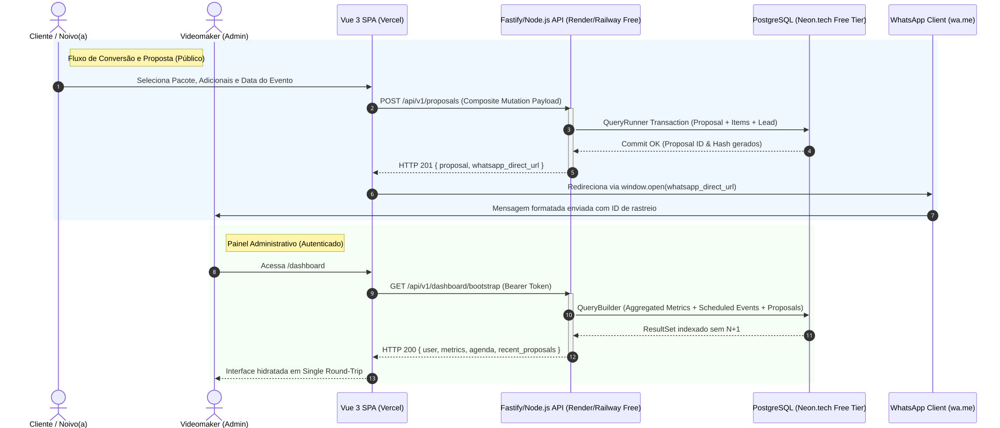
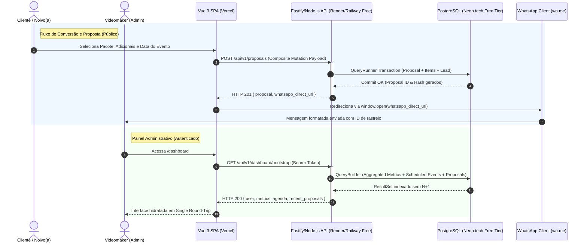

**FASE 1: Arquitetura & Fluxo Consolidado**

O FrameFlow adota o padrão de API Agregada (Anti-Chatty) combinada com persistência atômica e disparo determinístico via Deep Link (wa.me), viabilizando operação custo zero sem servidores de webhook 24/7 para o cliente final.

<b>Código Mermaid</b>

